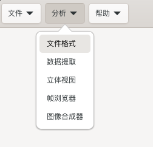
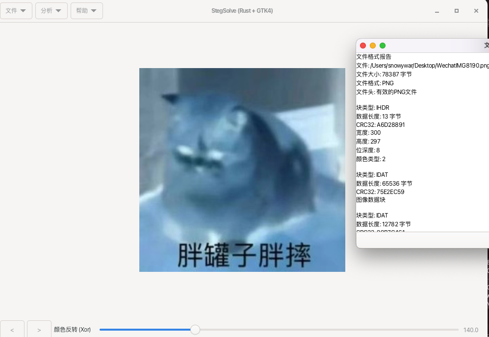
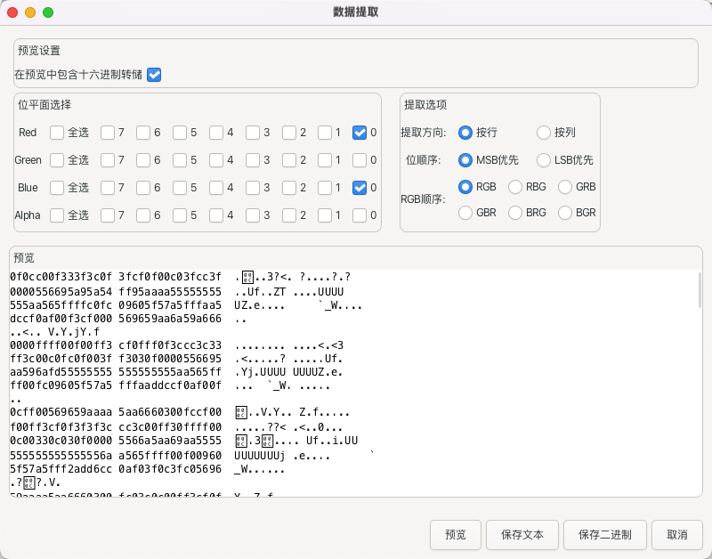

# StegSolve-rs 
StegSolve-rs 是一个基于 Rust + GTK4 重构的图像隐写分析工具，复刻重构了StegSolve
## 主要功能
java原版全功能重构

## 功能截图

## Why Rust+GTK4?
rust重构一切！
其他的gui要么基于web，要么有更多自己的组件外包，而gtk直接在原本rust和gnome基础上进行开发，简单快捷，也没那么丑。

## 如何运行
`cargo run`
## todo

- [x] 自动流水线打包全平台
- [ ] 多语言支持
- [ ] 项目结构重构

## 许可证
[MIT License](LICENSE)